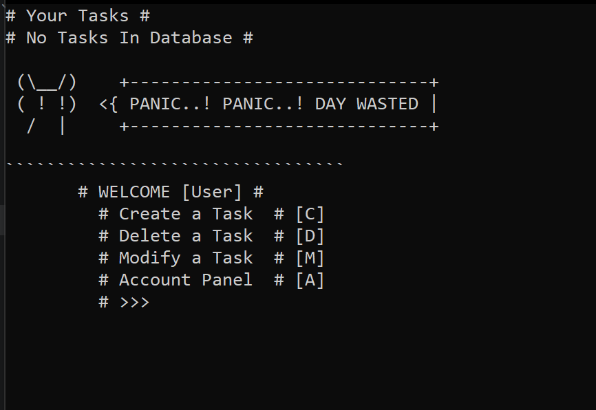

# todo
a simple terminal based todo applicartion with some intresting things
# features
1. Offers time and date with tasks created.
2. task modification and deletion.
2. Has a companion.
3. Has a Login system [file based: see data/].
# companion 
Meet your companion waiting for you.

```
(\__/)   +------+
( ^ ^) <{ hello |
/   |    +------+
```
* it has 19 different expressions, that will appear randomly.
* please do not touch the `mascot.txt` file untill you know what you are doing.
* please remember the file is following 3 line mascot and 1 line space format,
if one wish to create custom expressions or mascot kindly follow the same or else modify the `load_mascots()` in the code.
# example image


